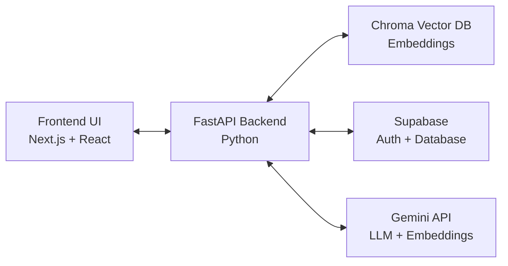
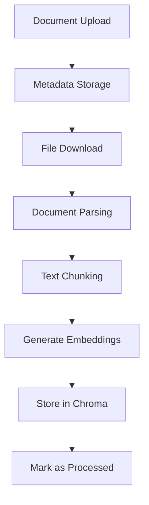
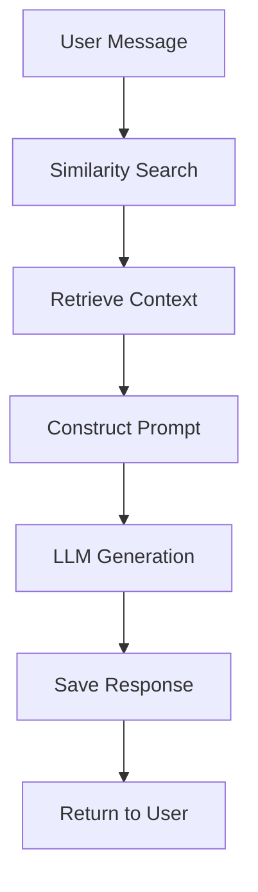

# AiPlanet 🚀

> A powerful document ingestion and Retrieval Augmented Generation (RAG) platform for intelligent document interactions

[](https://python.org)
[](https://fastapi.tiangolo.com)
[](https://nextjs.org)
[](LICENSE)

## ✨ Features

- **🔄 Workflow Management**: Create and manage custom workflows with prompt templates and model configurations
- **📄 Document Processing**: Intelligent document ingestion with chunking and embedding
- **💬 Contextual Chat**: Chat with your documents using advanced RAG technology
- **🗄️ Vector Storage**: Powered by Chroma vector database for efficient similarity search
- **👥 Session Management**: Organize conversations with persistent session storage
- **🔌 API-First**: RESTful API architecture for seamless integrations

---

## 🎥 Demo Video

[](https://www.youtube.com/watch?v=i8p12AMvl_U)


---

## 🏗️ Architecture



### Tech Stack

| Component | Technology |
|-----------|------------|
| **Frontend** | Next.js, React, Tailwind CSS |
| **Backend** | FastAPI, Python 3.9+ |
| **Database** | Supabase (PostgreSQL) |
| **Vector Store** | Chroma DB |
| **Authentication** | Supabase Auth |
| **LLM/Embeddings** | Google Gemini API |

## 🚀 Quick Start

### Prerequisites

Before getting started, ensure you have:

- **Python 3.9+** installed
- **Node.js 18+** and npm/yarn
- **Supabase** account with API keys
- **Google Gemini API** key
- **Docker** (optional, for containerized deployment)

### Installation

1. **Clone the repository**
   ```bash
   git clone https://github.com/Yash-pede/aiplanet.git
   cd aiplanet
   ```

2. **Backend Setup**
   ```bash
   cd backend
   python -m venv venv
   source venv/bin/activate  # On Windows: venv\Scripts\activate
   pip install -r requirements.txt
   ```

3. **Environment Configuration**
   ```bash
   cp .env.example .env
   ```
   
   Update your `.env` file:
   ```env
   SUPABASE_URL=your_supabase_url
   SUPABASE_ANON_KEY=your_supabase_anon_key
   SUPABASE_SERVICE_KEY=your_supabase_service_key
   GOOGLE_API_KEY=your_gemini_api_key
   CHROMA_PATH=./chroma_db
   TEMP_DIR=./temp
   DEBUG=true
   ```

4. **Start the Backend**
   ```bash
   uvicorn app.main:app --reload --host 0.0.0.0 --port 8000
   ```

5. **Frontend Setup**
   ```bash
   cd ../client
   npm install
   npm run dev
   ```

## 📖 Usage

### Creating a Workflow

1. Navigate to the workflows section
2. Define your prompt template
3. Select your preferred LLM and embedding models
4. Configure document sources
5. Save and activate your workflow

### Document Processing

1. Upload documents through the UI or API
2. Documents are automatically:
   - Downloaded and parsed
   - Split into meaningful chunks
   - Embedded using Gemini
   - Stored in Chroma vector database

### Chatting with Documents

1. Create a new chat session
2. Select your workflow
3. Ask questions about your documents
4. Get contextual responses powered by RAG

## 🔌 API Reference

### Core Endpoints

| Endpoint | Method | Description |
|----------|--------|-------------|
| `/api/health` | GET | Health check |
| `/api/workflows` | GET, POST | Manage workflows |
| `/api/workflows/{id}` | GET, PUT, DELETE | Individual workflow operations |
| `/api/workflows/{id}/execute` | POST | Execute workflow |
| `/api/documents` | POST | Upload document metadata |
| `/api/sessions` | POST | Create chat session |
| `/api/messages` | POST | Send message |

### Metadata Endpoints

| Endpoint | Method | Description |
|----------|--------|-------------|
| `/api/metadata/available-embedding-models` | GET | List available embedding models |
| `/api/metadata/available-llm-models` | GET | List available LLM models |

For detailed API documentation, visit `/docs` when running the backend server.

## 📁 Project Structure

```
aiplanet/
├── backend/                 # FastAPI backend
│   ├── app/
│   │   ├── api/            # API routes
│   │   ├── services/       # Business logic
│   │   ├── dao/           # Data access objects
│   │   ├── clients/       # External service clients
│   │   ├── schemas/       # Pydantic models
│   │   └── core/          # Configuration and utilities
│   ├── requirements.txt
│   └── .env.example
├── client/                 # Next.js frontend
│   ├── app/               # App router pages
│   ├── components/        # React components
│   ├── hooks/            # Custom React hooks
│   ├── lib/              # Utility libraries
│   └── utils/            # Helper functions
├── docker-compose.yml     # Docker configuration
└── README.md
```

## 🔧 Configuration

### Backend Configuration

Key configuration options in `app/core/config.py`:

- `APP_NAME`: Application name
- `API_PREFIX`: API route prefix
- `CORS_ORIGINS`: Allowed CORS origins
- `DEBUG`: Debug mode toggle

## 🔄 How It Works

### Document Processing Pipeline



### Chat Flow



## 🔐 Security

- **Authentication**: Supabase-based user authentication with JWT tokens
- **Authorization**: Role-based access control per user
- **CORS**: Configurable cross-origin resource sharing
- **Input Validation**: Comprehensive request validation using Pydantic
- **Error Handling**: Secure error responses without sensitive data exposure

## 🚧 Roadmap

### Short Term
- [ ] Support for additional file formats (Word, HTML, Images)
- [ ] Dynamic model switching during conversations
- [ ] Enhanced UI for workflow visualization
- [ ] Improved error handling and user feedback

### Medium Term
- [ ] Advanced admin dashboard
- [ ] Parallel document processing
- [ ] Caching layer for improved performance
- [ ] Webhook support for integrations

### Long Term
- [ ] Multi-tenant architecture
- [ ] Custom model fine-tuning
- [ ] Advanced analytics and insights
- [ ] Enterprise SSO integration


<div align="center">
  <strong>Built with ❤️ by the Yash Pede</strong>
</div>
